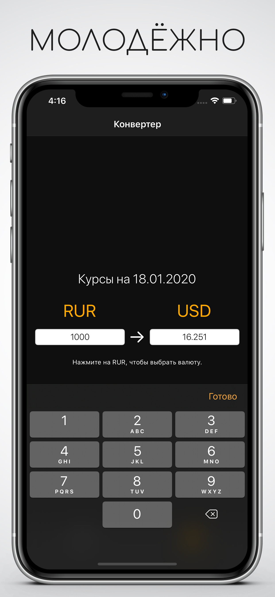

# Rubles – exchange rates
Rubles is a simple and quick application with current exchange rates from the Central Bank of Russia. In addition to the main functionality, the application allows you to track rates for the past date, as well as convert the presented currencies.

If you find a bug in this application, please write to pvt.belikov@gmail.com

**Screenshots:**

  
